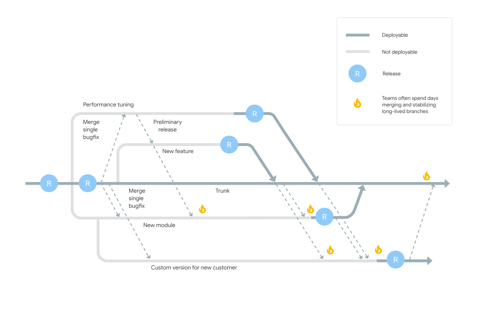

# Who Should Read This?

Before joining the project you should read this if you are in these groups:

- **Frontend Developers**
- **Backend Developers**
- **Full-stack Developers**
- **DevOps Engineers**
- **QA Engineers**
- **Project Managers/Leads**

This documentation serves as a roadmap for smooth collaboration, high-quality work, and efficient progress for all members of the team.

# Motivation

Our software development practices are based on principles of [Continuous Delivery](https://dora.dev/devops-capabilities/technical/continuous-delivery/), as highlighted in the DORA research ([DORA Research Program](https://services.google.com/fh/files/misc/dora_research_program.pdf)) and advocated in the book [Accelerate](https://www.amazon.com/Accelerate-Software-Performing-Technology-Organizations/dp/1942788339). 

## DORA


The [DevOps Research and Assessment](https://dora.dev/) (DORA) program was started in 2014 by Dr. Nicole Forsgren, Jez Humble, and Gene Kim. Their aim was to investigate the practices, tools, and culture models that make high-performing teams effective. Over the years, the DORA team's research has made significant contributions to our understanding of software development and operations, helping to shape the principles of modern DevOps practices. In 2018, the DORA team became a part of Google Cloud, allowing them to further extend their reach and impact.

## Accelerate


"[Accelerate](https://www.amazon.com/Accelerate-Software-Performing-Technology-Organizations/dp/1942788339): The Science of Lean Software and DevOps: Building and Scaling High Performing Technology Organizations" is a pivotal book released in 2018 by Dr. Nicole Forsgren, Jez Humble, and Gene Kim. Drawing on the same research behind the DORA program, which the authors also founded, this book offers an in-depth analysis of effective software development and operational practices.

"Accelerate" is based on extensive empirical research covering thousands of tech professionals and demonstrates how to measure software team performance and the factors influencing it. It has significantly influenced organizations' understanding of DevOps' role, offering a practical framework for adopting these principles and improving software delivery.

### Key findings

💼 **Small Batch Sizes & Frequent Code Deployments**: High-performing teams often deliver work in small batches and deploy code frequently.

🌳 **Trunk-Based Development**: High performers consistently employ this practice, leading to better overall performance.

🔄 **Continuous Delivery Impact**: Teams practicing Continuous Delivery, including comprehensive configuration management, automated testing, and deployment, experience lower change failure rates and faster recovery times.

👥 **Culture & Collaboration**: A culture promoting information sharing, trust, and collaboration correlates with better software delivery performance and reduced burnout.

📈 **Performance & Competitive Advantage**: Effective software delivery and operational practices can drive profitability, productivity, customer satisfaction, and overall competitive advantage.

These insights guide our team's development practices, striving for continuous improvement and high performance.


## Github Rules

The purpose of these guidelines is to create a clean, streamlined, and efficient process for collaboration to build and deliver quality software. 

### Branching

We follow a [Trunk Based Development](https://cloud.google.com/architecture/devops/devops-tech-trunk-based-development) model, which is a critical practice in Continuous Delivery and entails:

- All developers work on a single branch named `main`.
- New features, bug fixes, or any other changes are made in short-lived feature branches which are branched off of `main`.
- These feature branches should be merged back into `main` as soon as possible to avoid long-lived branches that may cause merge conflicts and diverging code bases.



### Pull Requests (PRs)

📑 **Small Number of Open PRs**: Limit the number of open PRs to streamline review and feedback.

📊 **Single Feature/ Bugfix per PR**: Keep PRs focused on one issue for easier review and understanding.

👀 **Mandatory Code Reviews**: Every PR must undergo a review from at least one other developer.

📝 **Fill the PR Descriptions template**: Be concise and clear in your PR descriptions, use the profided template to fill it.

### Code Reviews

**As a PR owner**, there are 2 primary reasons for requesting a code review:

1. **Early Direction Check**: You may wish to verify the direction of your work at an early stage. For this, open the PR as a `draft` and ask for a peer to check it. It should not be merged, and the draft status **should only be changed by the PR owner**.
2. **Production Merge Request**: After you've verified changes on the staging environment (see the [How to test on staging](#how-to-verify-on-staging) section), you change the status from `draft` to `ready for review` and ask a peer to review the PR.

**As a Reviewer:**

1. **Leave Meaningful Comments**: You should leave meaningful comments and provide feedback based on SOLID principles or any other team guidelines. Always include a link to the relevant guideline when possible.
2. **Mark as 'Commented'**: If you're okay with the changes but unsure about the overall business logic.
3. **Mark as 'Rejected'**: If you believe that the changes are not ready for production.
4. **Mark as 'Approved'**: If you believe that the changes are ready for production.


### Naming Conventions

- Branch names should be concise, descriptive and reflect the task at hand, e.g., `feat/login-system`, `fix/password-reset`.
- If (and usually this is the case) the branch is related to a Jira ticket, in that case the branch name should reflect the ticket ID, e.g. `BC-177`


# Continuous Delivery

In line with the practices of [Continuous Delivery](https://dora.dev/devops-capabilities/technical/continuous-delivery/), any code that is merged into the `main` branch should be deployable. The team shoud ensure that deployment to production happens automatically whenever code is merged into `main`. 

## Continuous Integration (CI)

This practice involves developers regularly merging their code changes into a central repository, preferably several times a day. After the code is merged, automated builds and tests are run to catch and fix integration errors quickly. The goal is to avoid "integration hell," where merging code that developers have worked on separately becomes problematic due to significant divergence in the codebase.

To ensure the reliability and stability of the `main` branch, we have a set of CI checks that must be passed before any code can be merged. These checks are implemented as GitHub Actions and include:

- [Unit & Feature Tests](.github/workflows/tests.yml): These ensure that the individual units of your code and their interactions are working as expected.
- [Static Analysis (Larastan)](.github/workflows/larastan.yml): Larastan is used to perform static analysis of the PHP code to detect errors without actually running the code.
- [Formatting (Pint)](.github/workflows/pint.yml): [Laravel Pint](https://laravel.com/docs/pint) is an opinionated PHP code style fixer for minimalists.
- E2E Tests (optional): If any end-to-end tests exist, they must be passed to ensure the system works together as a whole.
- TSLint Check: TSLint is used to ensure that the frontend TypeScript code adheres to a consistent style and does not contain any errors or issues.

## Continuous Delivery (CD)

This is the logical extension of CI. It's an approach where code changes are automatically built, tested, and prepared for release to production. It ensures that you can release new changes to your customers quickly and sustainably.

When the branch is merged (manually) to the `main` branch [an action](.github/workflows/auto-release.yml) will create a project tag.

Since we use Netlify for the frontend and Envoyer for the backend usually, let's see how to enable auto deployment on both frontend and backend. 

### CD - Backend

We use [envoyer](https://envoyer.io/) as a tool for the zero downtime deployment of our backend. To enable auto deployment on envoyer, you need to:

- go in envoyer in the [project settings](https://envoyer.io/projects/69177/settings#/source-control) and enable auto deploy when code is pushed:


### CD - Frontend

We use [netlify](https://app.netlify.com/) as a tool for the zero downtime deployment of our frontend. To enable auto deployment on netlify, we use a webhook that triggers the deployment when the code is deployed via envoyer, as part of the [deployment hooks](https://envoyer.io/projects/69177#/deployment-plan).


- To configure the webhook in netlify go [here](https://app.netlify.com/sites/project-name/configuration/deploys#build-hooks).

## How to verify on staging?

Given our single "main" branch approach, staging deployments are handled slightly differently to ensure that our main branch remains deployable at any time.

Here's the typical workflow for deploying to the staging environment:

1. **Local Development**: Work on your feature or bug fix on your local machine.

2. **Create a Pull Request**: Once you've tested your changes locally, push your changes to a remote branch on GitHub and create a pull request to the `main` branch. Ensure that you have added the relevant unit tests and the CI is passing.

3. **Code Review & Continuous Integration**: The pull request triggers our continuous integration pipeline, which includes unit & feature tests, static analysis, E2E tests.

4. **Deploy to Staging**: After all CI checks have passed, you may deploy your changes to the staging environment. For example, if you're working on branch `CE-1131`, you can go to Envoyer, find the [staging application](https://envoyer.io/projects), run deploy and choose your branch `CE-1131`:
5. For the frontend, you access the [Netlify staging branches and deploy contexts](https://app.netlify.com/sites/staging-revamp/configuration/deploys#branches-and-deploy-contexts) and change the branch to match your current branch:

Then go to [deploys](https://app.netlify.com/sites/staging-revamp/deploys) and trigger a new deploy manually:


5. **Staging Verification**: Once your changes have been deployed to staging, perform your validation and regression tests to ensure that everything works as expected.

6. **Merge to Main**: After successful validation in the staging environment, merge your pull request to the `main` branch. The merge triggers the automated deployment to the production environment.

By following these steps, we can ensure that our staging environment is used for testing and validation, and the `main` branch always reflects a stable state of the application ready for production.

----

## Feature Flagging and Partial Deployments

Feature flagging is a powerful technique that allows developers to enable or disable features in their application, even after the code has been deployed to production. This is achieved by wrapping a piece of code or functionality with a conditional statement (the "flag") which checks whether the feature is enabled or not. 

### Benefits of Feature Flagging
1. **Reduced Risk**: With feature flags, you can deploy code to production while it's still under development but hidden from users, thus mitigating the risk of introducing new bugs into the production environment.
2. **Gradual Rollouts**: Feature flags enable you to gradually roll out a new feature to a subset of users, helping to minimize the impact of potential issues and making it easier to manage the release.
3. **Testing in Production**: Feature flags can be used to perform A/B testing and Canary releases, which provide valuable insights about user behavior and preferences.

### Using Laravel Pennant for Feature Flagging
In the context of our Laravel project, we are using the Laravel Pennant package for feature flagging. Pennant allows you to define feature flags based on conditions and user attributes, providing a high degree of flexibility.

Here is how to define a feature flag with Pennant:

```php
namespace App\Providers;

use App\Models\User;
use Illuminate\Support\Lottery;
use Illuminate\Support\ServiceProvider;
use Laravel\Pennant\Feature;

class AppServiceProvider extends ServiceProvider
{
    public function boot(): void
    {
        Feature::define('new-api', fn (User $user) => match (true) {
            $user->isInternalTeamMember() => true,
            $user->isHighTrafficCustomer() => false,
            default => Lottery::odds(1 / 100),
        });
    }
}
```
In the above example, the feature flag 'new-api' is defined, and it uses a callback function to decide whether the feature should be enabled for a particular user.

To check whether a feature is enabled for a particular request, you can use the `Feature::active` method:

```php
class PodcastController
{
    public function index(Request $request): Response
    {
        return Feature::active('new-api')
                ? $this->resolveNewApiResponse($request)
                : $this->resolveLegacyApiResponse($request);
    }
 
    // ...
}
```

In the above code, if the 'new-api' feature is active, the new API response is resolved, otherwise, the legacy API response is resolved. This means that your application can have different behavior depending on whether a feature is enabled or not. 

Feature flagging and partial deployments are a part of modern software delivery practices that can help teams reduce risk, get user feedback early, and adapt to changes quickly.

# Approach to Implementing Large Features with Feature Flagging

Feature flagging allows us to partially deploy larger features into production, enabling users to interact with a new feature while the rest of the feature is still in development.

Let's consider an example: we are tasked to integrate the SignRequest functionality, allowing users to sign documents digitally.

## Components
The following components are required for this feature:

* SignRequest Facade for API calls
* SignRequestDocument model 
* Domain action CreateSignRequestDocumentAction
* Custom exception SignRequestException
* Logs using a custom channel `signrequest` 
* A Restify action (RequestSignatureRestifyAction.php) to Request the signature 

## Steps for Partial Deployment using Feature Flagging
1. **Development of core components**: Start by developing the core components such as the SignRequest Facade, documents model, and the logging system. These components do not directly impact the user interface and hence, can be developed without affecting the current app. And they can be merged into the trunk branch as soon they are ready.

2. **Feature Flag**: Implement a feature flag for the new functionality using the Laravel Pennant package. The flag will be used to control the visibility of the new API endpoint. 

3. **Restify Action**: Develop the RequestSignatureRestifyAction, which will be the point of exposure for the new feature. Ensure that this action is controlled by the feature flag, meaning it is only accessible when the feature flag is active.

```php
use Laravel\Pennant\Feature;
use Binaryk\LaravelRestify\Http\Requests\RestifyRequest;

...
public function actions(RestifyRequest $request): array
{
    return [
        RequestSignatureRestifyAction::make()->canSee(fn () => Feature::active('sign-request')),
    ];
}
```

4. **Deploy & Test**: Deploy the new changes to the production environment and activate the feature flag for a select group of users for testing.

5. **Iterate**: Continue development, regularly deploying non-interactive changes and expanding the group of users who have access to the new feature.

6. **Full Deployment**: Once all components are developed and tested, fully enable the feature flag, making the new SignRequest functionality available to all users.

Remember, while the non-interactive components (Facade, model, logs) are safe to deploy at any time, changes to user-facing components (like the Restify action) should always be protected with a feature flag to ensure that incomplete features are not exposed to all users prematurely.


# Encouraging Frequent Deploys and Merges

Developers are strongly encouraged to deploy and merge their code to the `main` branch frequently. This practice promotes more granular updates, allowing us to spot and address potential issues early in the development process.

However, to ensure the stability and reliability of the production environment, features should only be fully activated when they are ready. 

To handle this, we use **Feature Flagging**.

## Feature Flagging

Using feature flags (also known as "toggles" or "switches"), you can hide, enable or disable the feature in production as needed without having to redeploy the code. This provides the flexibility to merge code into `main` more frequently, while ensuring only complete and tested functionality is accessible to users.

The feature flag allows us to control the feature's visibility, not only on a global level but also at a granular level, such as per user or group of users. This aids in conducting controlled tests in the production environment with a limited set of users before a full-scale rollout.

Remember, merging frequently doesn't mean exposing incomplete work. It's about improving the project's code quality, reducing merge conflicts, and making it easier to find and fix bugs. 

With feature flags, we can ensure that code deployed to `main` is production-ready, but only accessible when we decide the time is right. As a result, we get the best of both worlds: continuous integration and delivery of code, and the control to release new features when we're confident they're ready for all users.

## Split.io Integration

We utilize Split.io for feature flagging to enable controlled rollouts of new features. This aids us in mitigating risk and improving our system by allowing us to manage who sees what and when.

The flags created on Split.io need to be synchronized with our application. For this, we use a daemon set up through Laravel Forge. This process continuously runs in the background and ensures that all the feature flags remain in sync with Split.io.

To setup Split.io synchronization as a Forge daemon, use the following command: 

```
split-sync -apikey "your-split-io-secret-api-key"
```

[Split sync docs](https://help.split.io/hc/en-us/articles/360019686092-Split-Synchronizer)

# Monitoring and Logging

## Observability

Observability is a core principle in our system's operation. We strive to not only know how our system is working but also predict if it might fail in the future. This involves monitoring every aspect of our system closely.

## Types of Logs

Our system generates three types of logs:

1. **Information**: These logs offer diagnostic information that helps us understand how the system is performing. If you inspect these logs, they should provide sufficient information to help you diagnose any issues that might arise.

2. **Warnings**: Warnings are generated when something doesn't go as smoothly as expected, but the system is still able to function—for example, when an API call retries due to a delay. These logs help us identify potential issues that might escalate if not addressed promptly.

3. **Errors**: Error logs indicate that something has gone wrong, such as a timeout or data loss. The system attempted an operation but had to give up. All errors generate an alert in our Slack channel and require a dedicated ticket for resolution. Sometimes, upon investigation, we might find that what was initially classified as an error is more appropriately a warning.

### Slack Notifications

Our system is set to send real-time notifications to a dedicated Slack channel in case of errors. Every error generates a unique alert to ensure no issue goes unnoticed.

We developed a lightweight package to handle that called [laravel-developer](https://github.com/BinarCode/laravel-developer#send-exception-to-slack).

For warnings, to prevent notification flood, we use a throttling mechanism. The system sends a collective notification for the same warning every 'N' occurrences, keeping the team informed without creating noise. This approach helps maintain system transparency and efficiency.

## The Purpose of Logging

Logging serves several critical functions:

- **System Monitoring**: Logs provide real-time insights into our system's operation. They allow us to track the system's performance and identify any potential issues.
  
- **Noise Reduction**: Proper logging helps filter out irrelevant information, reducing noise and making problem diagnosis easier.

- **Error Verification**: Logs help us distinguish between actual errors and false positives.

- **Post-deployment Tracking**: Following a deployment, logs allow us to track warnings generated per second and any changes in this rate, helping identify any deployment-related issues.

- **Automated Monitoring**: As humans, we are prone to errors and inefficiencies. Automating log generation and monitoring reduces human error and ensures consistent tracking.

- **Error Visibility**: It's crucial not to hide any errors. If an error is caught but not handled, it should be logged as an error. If it's caught and handled appropriately, it should be logged as a warning. Clear guidelines for this are provided in our engineering handbooks.

## Monitoring Tools

For monitoring, we utilize:

- [Oh Dear](https://ohdear.app/sites): This is used to monitor scheduled commands, providing critical information on their performance and alerting us if anything goes wrong.

- [Flare](https://flareapp.io/projects): Flare is a tool tailored for Laravel. It monitors logs and alerts us over Slack if any exceptions are thrown.

## Push exceptions to the consumer

When the system cannot recover from an exception that originates in the domain (business) layer, this exception is pushed up to the consumer layer. The consumer (which might be Controllers, Restify, Queued Jobs, or Commands) then decides whether to log the exception or return it to the client. This approach allows us to effectively manage exceptions and maintain stability.

When the system can recover, you don't have to forward the exception to the consumer, you simply try/catch it in the domain layer and recover the system accordingly.


## Backend

### Setup

Assuming you have composer and PHP installed in your environment, navigate to the project's directory and run:

```bash
composer install
cp .env.example .env
php artisan key:generate
```
Make sure to setup the correct DB connections and other required .env parameters.

Then run the migrations:
```bash
php artisan migrate
```
And finally, start the server:
```bash
php artisan serve
```

## CI/CD Tools
* [PHPUnit](https://phpunit.de/) for integration and unit tests.
* [PHPInsights](https://github.com/nunomaduro/phpinsights) for automatic code complexity measurement.
* [Rector](https://github.com/rectorphp/rector) for code quality improvement and dead code elimination.
* [Pint](https://laravel.com/docs/10.x/pint) for automatic code formatting according to [PSR12](https://www.php-fig.org/psr/psr-12/) standards.
* [PHPStan](https://phpstan.org/) for static code analysis.

## Package Integration

Our [Restify](https://restify.binarcode.com/) package is integrated, providing a [JSON:API](https://jsonapi.org/) **standard API**.

## Admin Panel and System Management

* [Laravel Nova](https://nova.laravel.com/) is integrated for the super admin panel.
* [Laravel Telescope](https://laravel.com/docs/10.x/telescope) is used for system logging.
* [Laravel Horizon](https://laravel.com/docs/10.x/horizon) is used for queue and async jobs management.

### 2. Frontend Setup:

Assuming you have Node.js and npm installed, navigate to the project's directory and run:

```bash
npm install
```

Then, compile and hot-reload for development:

```bash
npm run serve
```
---
## Running the Tests

(Instructions on how to run tests)

---

Our project follows industry best practices in terms of coding standards and software development lifecycle processes. By aligning our processes with the DORA research findings and the guidelines of "Accelerate", we strive to achieve high performance in software delivery and maintain a high degree of quality in our codebase. All contributions are greatly appreciated, and we look forward to collaborating with you. Happy Coding!
