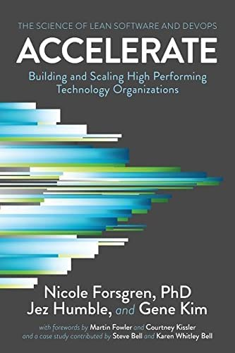

# Who Should Read This?

Before joining the project you should read this if you are in these groups:

- **Frontend Developers**
- **Backend Developers**
- **Full-stack Developers**
- **DevOps Engineers**
- **QA Engineers**
- **Project Managers/Leads**

This documentation serves as a roadmap for smooth collaboration, high-quality work, and efficient progress for all members of the team.

# Motivation

Our software development practices are based on principles of [Continuous Delivery](https://dora.dev/devops-capabilities/technical/continuous-delivery/), as highlighted in the DORA research ([DORA Research Program](https://services.google.com/fh/files/misc/dora_research_program.pdf)) and advocated in the book [Accelerate](https://www.amazon.com/Accelerate-Software-Performing-Technology-Organizations/dp/1942788339). 

## DORA


The [DevOps Research and Assessment](https://dora.dev/) (DORA) program was started in 2014 by Dr. Nicole Forsgren, Jez Humble, and Gene Kim. Their aim was to investigate the practices, tools, and culture models that make high-performing teams effective. Over the years, the DORA team's research has made significant contributions to our understanding of software development and operations, helping to shape the principles of modern DevOps practices. In 2018, the DORA team became a part of Google Cloud, allowing them to further extend their reach and impact.

## Accelerate




"[Accelerate](https://www.amazon.com/Accelerate-Software-Performing-Technology-Organizations/dp/1942788339): The Science of Lean Software and DevOps: Building and Scaling High Performing Technology Organizations" is a pivotal book released in 2018 by Dr. Nicole Forsgren, Jez Humble, and Gene Kim. Drawing on the same research behind the DORA program, which the authors also founded, this book offers an in-depth analysis of effective software development and operational practices.

"Accelerate" is based on extensive empirical research covering thousands of tech professionals and demonstrates how to measure software team performance and the factors influencing it. It has significantly influenced organizations' understanding of DevOps' role, offering a practical framework for adopting these principles and improving software delivery.

### Key findings

💼 **Small Batch Sizes & Frequent Code Deployments**: High-performing teams often deliver work in small batches and deploy code frequently.

🌳 **Trunk-Based Development**: High performers consistently employ this practice, leading to better overall performance.

🔄 **Continuous Delivery Impact**: Teams practicing Continuous Delivery, including comprehensive configuration management, automated testing, and deployment, experience lower change failure rates and faster recovery times.

👥 **Culture & Collaboration**: A culture promoting information sharing, trust, and collaboration correlates with better software delivery performance and reduced burnout.

📈 **Performance & Competitive Advantage**: Effective software delivery and operational practices can drive profitability, productivity, customer satisfaction, and overall competitive advantage.

These insights guide our team's development practices, striving for continuous improvement and high performance.


## Github Rules

The purpose of these guidelines is to create a clean, streamlined, and efficient process for collaboration to build and deliver quality software. 

### Branching

We follow a [Trunk Based Development](https://cloud.google.com/architecture/devops/devops-tech-trunk-based-development) model, which is a critical practice in Continuous Delivery and entails:

- All developers work on a single branch named `main`.
- New features, bug fixes, or any other changes are made in short-lived feature branches which are branched off of `main`.
- These feature branches should be merged back into `main` as soon as possible to avoid long-lived branches that may cause merge conflicts and diverging code bases.


### Pull Requests (PRs)

📑 **Small Number of Open PRs**: Limit the number of open PRs to streamline review and feedback.

📊 **Single Feature/ Bugfix per PR**: Keep PRs focused on one issue for easier review and understanding.

👀 **Mandatory Code Reviews**: Every PR must undergo a review from at least one other developer.

📝 **Fill the PR Descriptions template**: Be concise and clear in your PR descriptions, use the profided template to fill it.

### Naming Conventions

- Branch names should be concise, descriptive and reflect the task at hand, e.g., `feat/login-system`, `fix/password-reset`.
- If (and usually this is the case) the branch is related to a Jira ticket, in that case the branch name should reflect the ticket ID, e.g. `BC-177`


# Continuous Delivery

In line with the practices of [Continuous Delivery](https://dora.dev/devops-capabilities/technical/continuous-delivery/), any code that is merged into the `main` branch should be deployable. The team shoud ensure that deployment to production happens automatically whenever code is merged into `main`. 

## Continuous Integration (CI)

This practice involves developers regularly merging their code changes into a central repository, preferably several times a day. After the code is merged, automated builds and tests are run to catch and fix integration errors quickly. The goal is to avoid "integration hell," where merging code that developers have worked on separately becomes problematic due to significant divergence in the codebase.

To ensure the reliability and stability of the `main` branch, we have a set of CI checks that must be passed before any code can be merged. These checks are implemented as GitHub Actions and include:

- [Unit & Feature Tests](.github/workflows/tests.yml): These ensure that the individual units of your code and their interactions are working as expected.
- [Static Analysis (Larastan)](.github/workflows/larastan.yml): Larastan is used to perform static analysis of the PHP code to detect errors without actually running the code.
- [Formatting (Pint)](.github/workflows/pint.yml): [Laravel Pint](https://laravel.com/docs/pint) is an opinionated PHP code style fixer for minimalists.
- E2E Tests (optional): If any end-to-end tests exist, they must be passed to ensure the system works together as a whole.
- TSLint Check: TSLint is used to ensure that the frontend TypeScript code adheres to a consistent style and does not contain any errors or issues.

## Continuous Delivery (CD)

This is the logical extension of CI. It's an approach where code changes are automatically built, tested, and prepared for release to production. It ensures that you can release new changes to your customers quickly and sustainably.

When the branch is merged (manually) to the `main` branch [an action](.github/workflows/auto-release.yml) will create a project tag.

Since we use Netlify for the frontend and Envoyer for the backend usually, let's see how to enable auto deployment on both frontend and backend. 

### CD - Backend

Go in envoyer in the project settings and enable auto deploy when code is pushed:


### CD - Frontend

Given the difference in build times between the backend (deployed via Envoyer) and frontend (deployed via Netlify), it's possible for the backend changes to go live while the frontend is still building. If there are breaking changes between the two, it could lead to inconsistencies or issues.

To handle such situations, consider the following strategy:

### Building Frontend Assets in GitHub Actions

You can build the frontend assets as part of your GitHub Actions workflow. Once the build is complete, a subsequent step in your workflow could call the Envoyer webhook. This would trigger the backend deployment. At the same time, you can also pull the latest changes from the "main" branch on Netlify. This strategy ensures that both your backend and frontend are in sync when changes go live.

## Backend and Frontend Deployment Procedure

With this strategy, the deployment procedure would look like this:

1. Ensure your changes are ready and tested in the appropriate branches.
2. Merge your changes to the "main" branch.
3. The merge triggers the CD pipeline. Before merging to "main", the code should pass all checks (unit & feature tests, static analysis, E2E tests, etc.).
4. Once all checks have passed, GitHub Actions will start building the frontend assets.
5. After building the frontend, it will add assets into the release tag (say 1.2.0)
6. The GitHub Actions workflow calls the Envoyer webhook, triggering the backend deployment.
7. The last step in Envoyer will trigger the deploy on netlify wich will simply pull the assets built with gh action

By using this procedure, you ensure that both backend and frontend are always in sync when deployed, minimizing potential issues for your users. Always ensure thorough testing before deploying and monitor your application closely after deployment for any unexpected issues.


## How to verify on staging?

Given our single "main" branch approach, staging deployments are handled slightly differently to ensure that our main branch remains deployable at any time. 

Here's the typical workflow for deploying to the staging environment:

1. **Local Development**: Work on your feature or bug fix on your local machine, adhering to the guidelines mentioned in the Github Rules section. 

2. **Create a Pull Request**: Once you've tested your changes locally, push your changes to a remote branch on GitHub and create a pull request to the `main` branch. Ensure that you have added the relevant unit tests and they are passing. 

3. **Code Review & Continuous Integration**: The pull request triggers our continuous integration pipeline, which includes unit & feature tests, static analysis, E2E tests (if present), and TSLint check on FE. The code is also reviewed by your peers during this time.

4. **Deploy to Staging**: After your pull request has been approved and all CI checks have passed, you may deploy your changes to the staging environment. For example, if you're working on branch BC-177, you can go to Envoyer, find the staging application, run deploy and choose your branch. For the frontend, you should either have a Netlify deploy preview or go to your app in Netlify and deploy it from your branch on staging. 

    This deployment strategy means that only one branch can be deployed to a staging environment at a time. To facilitate simultaneous testing by multiple teams, each team should have its own dedicated staging environment if they are all working on the same project.

5. **Staging Verification**: Once your changes have been deployed to staging, perform your validation and regression tests to ensure that everything works as expected. 

6. **Merge to Main**: After successful validation in the staging environment, merge your pull request to the `main` branch. The merge triggers the automated deployment to the production environment.

By following these steps, we can ensure that our staging environment is used for testing and validation, and the `main` branch always reflects a stable state of the application ready for production.

----


- key metrics of team productivity
- A/B testing, deliverying features using A/B by default
-   ac


# Logging


## Getting Started

After cloning the project, follow the below steps to setup the environment:

### 1. Backend Setup:

Assuming you have composer and PHP installed in your environment, navigate to the project's directory and run:

```bash
composer install
cp .env.example .env
php artisan key:generate
```
Make sure to setup the correct DB connections and other required .env parameters.

Then run the migrations:
```bash
php artisan migrate
```
And finally, start the server:
```bash
php artisan serve
```

### 2. Frontend Setup:

Assuming you have Node.js and npm installed, navigate to the project's directory and run:

```bash
npm install
```

Then, compile and hot-reload for development:

```bash
npm run serve
```
---
## Running the Tests

(Instructions on how to run tests)

---

Our project follows industry best practices in terms of coding standards and software development lifecycle processes. By aligning our processes with the DORA research findings and the guidelines of "Accelerate", we strive to achieve high performance in software delivery and maintain a high degree of quality in our codebase. All contributions are greatly appreciated, and we look forward to collaborating with you. Happy Coding!
